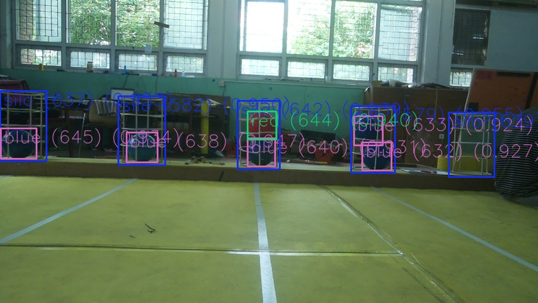
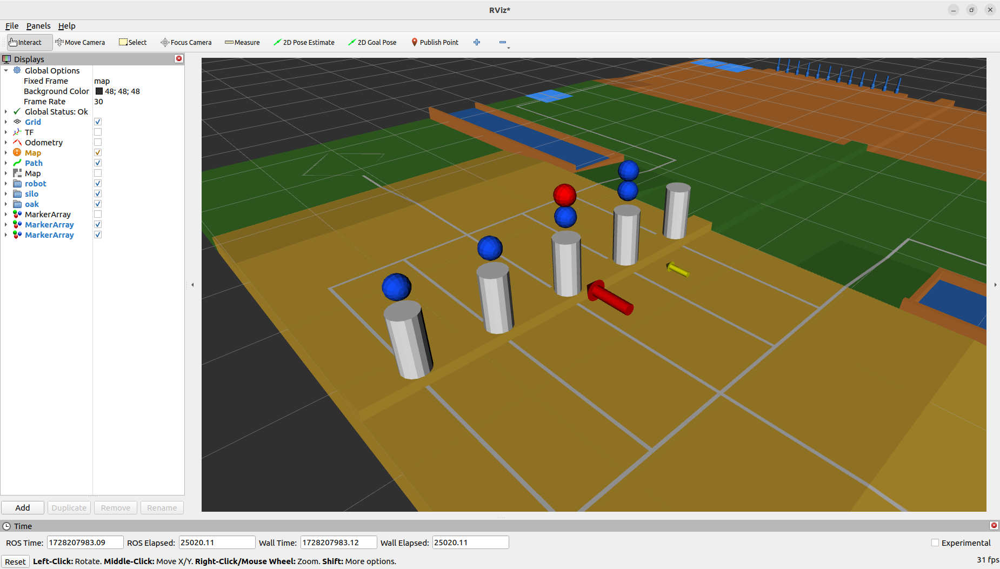

# Computer Vision codebase for ABU Robocon-2024 Automatic Robot | Part II: Choose Best Possible Storage Vessel (Silo)

## About Official Contest

For this year's theme, it was necessary to build an automatic robot that can **navigate to pick up Rice Grains** (representation of selecting good paddy rice among bad ones). In the Zone 3, there would be ***Empty Grain (Purple Color)*** and ***Rice Grain : Team Color (Red or Blue)***. Automatic robot needed to pick up Rice Grain and store them in 5 vessels common to both the teams & the scoring was done on the basis of which team stored more grains. 

For scoring, if a team **captures 3 storage vessels(silos)** then that team gets **instant victory (Mua Vang)** otherwise each storage of a Rice Grain results in **30 points**. To capture a silo:  
1. 2 out of 3 Rice Grain, should be of own team color
2. Top Rice Grain must be of own team color

### References
  [Contest Website](https://aburobocon2024.vtv.gov.vn/)  
  [Theme video](https://www.youtube.com/watch?v=zavE1DzyH6Q)

## Introduction

This is a ROS2 humble python package. It uses PiCamera v3 faced towards silos to observe the state. The image is captured in Raspberry Pi and sent to laptop(dev machine) through Ethernet cable. Then, laptop receives RGB frame and it is published to a topic. YOLOv8-ROS **detects color of Rice Grains stored and silo**. Using the team color, X coordinates of bounding boxes of silos and both X & Y coordinates of bounding boxes of Rice Grains; instantaenous state of visible silos is observed. Initially, absolute state of all 5 silos is empty and the absolute state is updated based on observed state of silos. Then, **2 best optimal silos are selected as per the priority order of chance of capturing silo** by considering the silos' state and one nearest from robot. The optimal silos are continuously published continuously at 20Hz and updated depending upon the inference time of YOLOv8 model.

<div style="text-align: center;">
  
</div>

**Fig: Object detection of Red and Blue Rice Grains along with Silo**

<div style="text-align: center;">
  
</div>

**Fig: State of silos and 2 best optimal silos for storage visualized in RVIZ2**

## Requirements

### Hardware
1. [Raspberry Pi Camera Module 3](https://www.raspberrypi.com/products/camera-module-3/) - Wide Angle Preferred
2. [Raspberry Pi 4B](https://www.raspberrypi.com/products/raspberry-pi-4-model-b/)
3. CSI cable - for connection between Pi and Picamera
4. Ethernet cable - for connection between Laptop and Raspberry Pi
5. **Optional:** A machine with **discrete GPU** (for quick model inference & real time performance)

### Setup in Raspberry Pi
1. Official **Raspbian OS** for camera support
2. Use **netplan** to establish connection with dev machine through Ethernet

### Development Environment & ROS2 necessities
1. Ubuntu 22.04 LTS Jammy Jellyfish (as ROS2 Humble is supported here)
2. [ROS2 humble desktop](https://docs.ros.org/en/humble/Installation.html)
3. [colcon](https://docs.ros.org/en/humble/Tutorials/Beginner-Client-Libraries/Colcon-Tutorial.html) - to build ROS2 packages
4. [rosdep](https://docs.ros.org/en/humble/Tutorials/Intermediate/Rosdep.html) - to manage dependencies
5. [YOLOv8-ROS package](https://github.com/tyro-apil/yolov8_ros)
6. Use **netplan** to establish connection with Raspberry Pi through Ethernet
7. **map -> base_link** transform as [Odometry msg](https://docs.ros2.org/foxy/api/nav_msgs/msg/Odometry.html) in **"/odometry/filtered"** topic
8. Picamera mounted almost around the center of center w.r.t. X axis of robot - for state estimation if less than 5 silos are seen in image frame
9. Custom ROS2 messages: [silo_msgs](https://github.com/tyro-apil/silo_msgs)
10. **Optional:** Gamefield URDF published in RVIZ2

### Python packages
1. ***picamera2*** - for interfacing Picamera v3 in ***Raspberry Pi***
2. ***opencv*** - for image processing
3. ***scipy*** - for representing Rotation (Orientation) of robot & destination as well as easy conversion from Euler Angles to Quaternion
4. ***numpy*** - for matrix operations


## How to use this package

### Package Name: "silo"

### Setting up connection through Ethernet
To transfer image frame from Raspberry Pi to laptop using sockets

1. Install netplan  
    ```
    sudo apt install netplan.io
    ```
2. Put the netplan configs from **ethernet** directory to **/etc/netplan** directory for both Raspberry Pi and Dev Machine
3. Apply the netplan config
    ```
    sudo netplan apply
    ```

    For testing the connection, ***ping*** each others' IP address.  


4. **ssh** into Raspberry Pi using its configured IP in netplan  
    For testing the camera connection
    ```
    libcamera-hello -t 0
    ```
5. Execute **tcp_server.py** script in Raspberry Pi

### Building ROS2 packages

Note: Change the config files in the config directory as per necessity.

1. Put the required packages mentioned above in same workspace i.e. inside ***src*** directory. Then, install dependencies using rosdep. Dependencies can be seen in **package.xml** and it can be installed manually.

    ```
    sudo rosdep init
    rosdep update
    ```
    ```
    rosdep install --from-paths src -y --ignore-src
    ```

2. Using colcon build packages from the workspace directory using symlink (so that changes in codebase is directly implemented without rebuilding (not in C++))
    ```
    colcon build --symlink-install
    ```

### Running the package

1. Source the installed files
    ```
    source install/setup.bash
    ```

2. Run this high level python launch file to run all the nodes
    ```
    ros2 launch silo silo.launch.py
    ```

  If you want to run individual nodes, you can run them as per their name in **setup.py**. Also, you can launch individual launch file for grouped functionality as per their name in **launch** directory.  
  [Guide for running nodes from CLI](https://docs.ros.org/en/humble/How-To-Guides/Node-arguments.html)  
  [Launch file tutorials](https://docs.ros.org/en/humble/Tutorials/Intermediate/Launch/Launch-Main.html)

### Errors Faced
1. If the TCP port of dev machine is busy, you can kill the port. So, that Pi can connect.
    ```
    # Find the process id (PID) 
    sudo lsof -nP -iTCP:12345 -sTCP:LISTEN      # Replace the port number as specified in scripts

    # Kill the process holding the port
    kill -15 <PID>
    # For forceful killing:
    kill -9 <PID>
    ```

